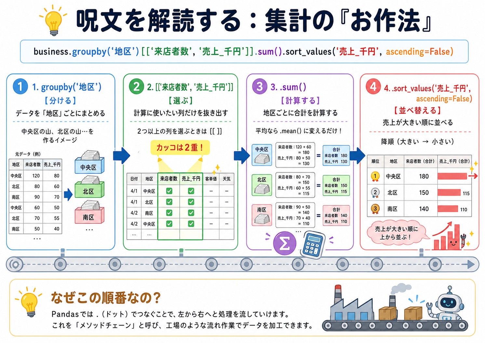

# プログラミング発展3（データ解析）授業用データ

京都精華大学「プログラミング発展3（データ解析）A/B」で使用するデータセットです。
授業中・課題で Google Colab から直接読み込んで使います。なお、notebookは搭載していません。

> ⚠️ これらは授業用に作成した**架空のデータ**です。実在の地域・店舗・人物とは関係ありません。

## Colab での読み込み方法

データは GitHub から直接読み込めます。**ファイルをダウンロードしたりアップロードしたりする必要はありません。**

```python
import pandas as pd

# データの置き場所（このリポジトリ）
BASE_URL = 'https://raw.githubusercontent.com/kken78/seika-data-analysis/main/'

business = pd.read_csv(BASE_URL + 'business_cafe_sales_clean.csv')
policy   = pd.read_csv(BASE_URL + 'policy_bus_demand_clean.csv')
profile  = pd.read_csv(BASE_URL + 'district_profile.csv')

print('読み込み完了')
```

> `BASE_URL` の「ユーザー名」「リポジトリ名」は、自分のリポジトリに合わせて書き換えてください。
> ブランチが `main` 以外の場合は、末尾の `main` も変更します。

## 解説画像の使い方

`method_chain.png` などの画像も、CSV と同じく GitHub から直接参照できます。
notebook（markdown セル）に次のように書くと、Colab で画像が表示されます。

```markdown

```

> 画像ファイル自体はこのリポジトリに置いてあるので、notebook（.ipynb）のファイルサイズは増えません。

## ファイル一覧

データは2種類あります。

- **clean 版**：きれいに整形済み。第2回〜第3回・第5回の集計や可視化で使います。
- **messy 版**：欠損や表記ゆれをわざと含んだ「生データ」。第4回の**前処理**の練習で使い、自分で clean な状態に整えます。

このほか、授業スライド・notebook で使う**解説画像**も置いています。

| ファイル名 | 内容 | 種類 | 行数 × 列数 |
| :--- | :--- | :--- | :--- |
| `business_cafe_sales_clean.csv` | 地域カフェの来店・売上データ | clean | 36 × 8 |
| `business_cafe_sales_messy.csv` | 同上（前処理用の生データ） | messy | 36 × 8 |
| `policy_bus_demand_clean.csv` | コミュニティバスの利用データ | clean | 36 × 8 |
| `policy_bus_demand_messy.csv` | 同上（前処理用の生データ） | messy | 36 × 8 |
| `district_profile.csv` | 地区ごとの基本情報（人口など） | clean | 6 × 5 |
| `method_chain.png` | メソッドチェーンの流れ（集計の「お作法」）の解説図 | 画像 | — |

## データプレビュー

各ファイルの先頭3行です（雰囲気をつかむ用）。

### clean 版

**business_cafe_sales_clean.csv**

| 月 | 地区 | SNS告知回数 | クーポン配布数 | イベント実施 | 来店者数 | 購入者数 | 売上_千円 |
| :--- | :--- | ---: | ---: | ---: | ---: | ---: | ---: |
| 2026-04 | 中央区 | 25 | 1137 | 0 | 886 | 424 | 565 |
| 2026-05 | 中央区 | 21 | 1151 | 1 | 1053 | 502 | 707 |
| 2026-06 | 中央区 | 20 | 1296 | 0 | 896 | 404 | 535 |

**policy_bus_demand_clean.csv**

| 月 | 地区 | 平日バス便数 | バス利用者数 | 遅延苦情件数 | 高齢化率 | 自家用車なし世帯率 | 住民説明会参加者数 |
| :--- | :--- | ---: | ---: | ---: | ---: | ---: | ---: |
| 2026-04 | 中央区 | 55 | 3526 | 14 | 16.7 | 32 | 37 |
| 2026-05 | 中央区 | 53 | 3433 | 12 | 16.7 | 32 | 60 |
| 2026-06 | 中央区 | 53 | 3522 | 11 | 16.7 | 32 | 42 |

**district_profile.csv**

| 地区 | 総人口 | 学生人口 | 高齢人口 | 世帯数 |
| :--- | ---: | ---: | ---: | ---: |
| 中央区 | 42000 | 6000 | 7000 | 21000 |
| 北区 | 31000 | 2800 | 6500 | 15000 |
| 南区 | 28000 | 2200 | 5400 | 13500 |

### messy 版（前処理の練習用）

「整っていないデータ」を再現しています。単位つきの数値・`¥` 記号・カンマ区切り・`yes`/`no`・`%`・欠損 `-` などが混ざっているのがわかります。

**business_cafe_sales_messy.csv**

| month | area | sns_posts | coupon_dist | event_flag | visitors | buyers | sales_yen |
| :--- | :--- | :--- | :--- | :--- | :--- | :--- | :--- |
| 2026/04 | 中央区 | 25回 | 1,137 | no | 886人 | 424人 | ¥565,000 |
| 2026/05 | 中央区 | 21回 | 1,151 | yes | 1,053人 | 502人 | ¥707,000 |
| 2026/06 | 中央区 | 20回 | 1,296 | no | 896人 | 404人 | ¥535,000 |

**policy_bus_demand_messy.csv**

| month | district_name | weekday_trips | riders | delay_complaints | elderly_ratio | no_car_ratio | meeting_participants |
| :--- | :--- | :--- | :--- | :--- | :--- | :--- | :--- |
| 2026/04 | 中央区 | 55本 | 3,526人 | 14件 | 16.7% | 32.0% | 37人 |
| 2026/05 | 中央区 | 53本 | 3,433人 | 12件 | 16.7% | 32.0% | 60人 |
| 2026/06 | 中央区 | 53本 | 3,522人 | 11件 | 16.7% | 32.0% | - |

### 解説画像：メソッドチェーンの流れ

`groupby → [[ ]] → sum → sort_values` の集計が、左から右へ「分ける→選ぶ→計算する→並べ替える」と流れていく様子を図にしたものです（第3回で使用）。



## 各ファイルの列

### clean 版

**business_cafe_sales_clean.csv**
月 / 地区 / SNS告知回数 / クーポン配布数 / イベント実施 / 来店者数 / 購入者数 / 売上_千円

**policy_bus_demand_clean.csv**
月 / 地区 / 平日バス便数 / バス利用者数 / 遅延苦情件数 / 高齢化率 / 自家用車なし世帯率 / 住民説明会参加者数

**district_profile.csv**
地区 / 総人口 / 学生人口 / 高齢人口 / 世帯数

### messy 版（前処理の練習用）

messy 版は、現実の「整っていないデータ」を再現しています。列名は英語で、次のような“汚れ”が含まれています。第4回では、これらを clean 版のような状態に整える練習をします。

- **列名が英語**（例：`month`, `area`, `visitors`）
- **数値に単位や記号が混ざっている**（例：`25回`、`1,137`、`886人`、`¥565,000`、`16.7%`）
- **地区名の表記ゆれ**（例：中央 / 中央区、南区 / 南エリア / 南 地区、北区 / 北地区）
- **欠損の表し方がバラバラ**（例：`-`、`不明`、空欄）
- **日付の形式**（例：`2026/04`）

**business_cafe_sales_messy.csv**
month / area / sns_posts / coupon_dist / event_flag / visitors / buyers / sales_yen

**policy_bus_demand_messy.csv**
month / district_name / weekday_trips / riders / delay_complaints / elderly_ratio / no_car_ratio / meeting_participants

#### messy → clean の対応（参考）

| messy 版の列 | clean 版の列 |
| :--- | :--- |
| month | 月 |
| area / district_name | 地区 |
| sns_posts | SNS告知回数 |
| coupon_dist | クーポン配布数 |
| event_flag（yes/no） | イベント実施（1/0） |
| visitors | 来店者数 |
| buyers | 購入者数 |
| sales_yen | 売上_千円 |
| weekday_trips | 平日バス便数 |
| riders | バス利用者数 |
| delay_complaints | 遅延苦情件数 |
| elderly_ratio | 高齢化率 |
| no_car_ratio | 自家用車なし世帯率 |
| meeting_participants | 住民説明会参加者数 |

## 地区について

すべてのデータで共通の6地区を使います（clean 版での正式表記）：
中央区 / 北区 / 南区 / 東区 / 西区 / 学園地区

## ライセンス・利用について

本リポジトリのデータは京都精華大学の授業内での学習を目的としています。
架空データのため自由に分析の練習に使えます。
